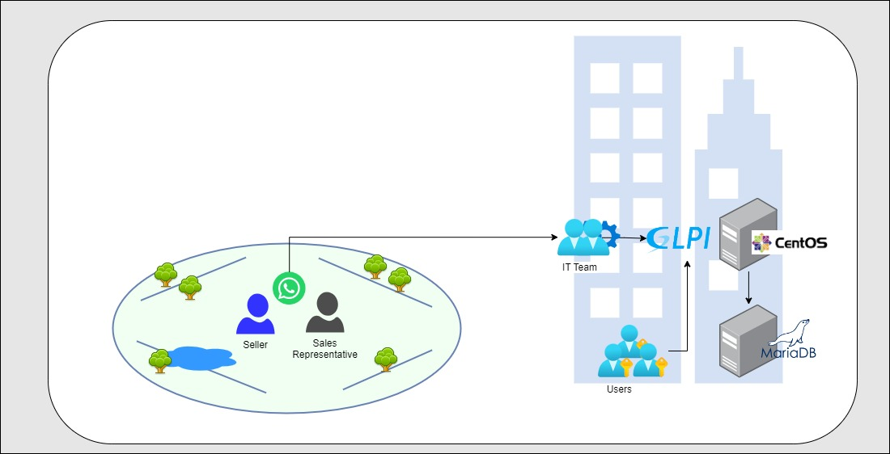

<h1 align="center"> AWS Workshop 20</h1>

  <a href="#Challenge">The challenge</a>&nbsp;&nbsp;&nbsp;|&nbsp;&nbsp;&nbsp;
  <a href="#Current Architecture">Current architecture</a>&nbsp;&nbsp;&nbsp;|&nbsp;&nbsp;&nbsp;  
  <a href="#Issues">Issues</a>&nbsp;&nbsp;&nbsp;|&nbsp;&nbsp;&nbsp;
  <a href="#ItemsTo BeEvaluated">Assessment</a>&nbsp;&nbsp;&nbsp;|&nbsp;&nbsp;&nbsp;
  <a href="#ProjectAdministration">Project Administration</a>&nbsp;&nbsp;&nbsp;|&nbsp;&nbsp;&nbsp;
  <a href="#Technologies">Technologies</a>&nbsp;&nbsp;&nbsp;|&nbsp;&nbsp;&nbsp;
  <a href="#Contributors">Contributors</a>&nbsp;&nbsp;&nbsp;|&nbsp;&nbsp;&nbsp;

## 🚀 THE CHALLENGE

Upper Plan is a company that develops pigments for plastics. The Upper Plan company's IT team needs to migrate the helpdesk ticket management system - GLPI - to the Cloud due to problems with slow access and use of the system.

## 🎲 CURRENT ARCHITECTURE

The actual GLPI infrastructure consists of

- A virtual machine 
    - [CentOS 7](https://www.redhat.com/en/topics/linux/centos-linux-eol#:~:text=Why%20is%20CentOS%20Linux%20going,Red%20Hat%20Enterprise%20Linux%20releases)
    - 10 GB of RAM 
    - 04 vCPUs
- Database
    - [MariaDB](https://mariadb.org/)
    - 30 GB
- 60 users 

## 🎲 IDENTIFIED ISSUES

The slow access problem is due to the current server hosting GLPI having memory and CPU resources at the maximum usage capacity.

## 📝 ASSESSSMENT
[ ] Presentation 
[ ] Documentation - business vision 
[ ] Documentation - technical details 
[ ] AWS Services used in the purposed Architecture 
[ ] Ticket request process implementation 
[ ] Participation of group members 
[ ] Demo 

## 🔗 PROJECT ADMINISTRATION
The project was divided into activities and managed using Kanban and Discord for communication and meetings.

## 🛠 TECHNOLOGIES

- GLPI
- Terraform
- GitHub and GitHub Actions
- MariaDB
- Docker
- AWS Services (Route53, Load Balancing, AutoScaling, ECS Fargate, ...)

## ✅ CONTRIBUTORS

<table style="width:100%">
  <tr>
    <td align="center"><a href="https://www.linkedin.com/in/victor-cleber/?locale=en_US"> <b>Victor Cleber</b></a> </td>
    <td align="center"><a href="https://www.linkedin.com/in/victor-cleber/?locale=en_US"> <b>Victor Cleber</b></a> </td>
    <td align="center"><a href="https://www.linkedin.com/in/victor-cleber/?locale=en_US"> <b>Victor Cleber</b></a> </td>
  </tr>  
</table>